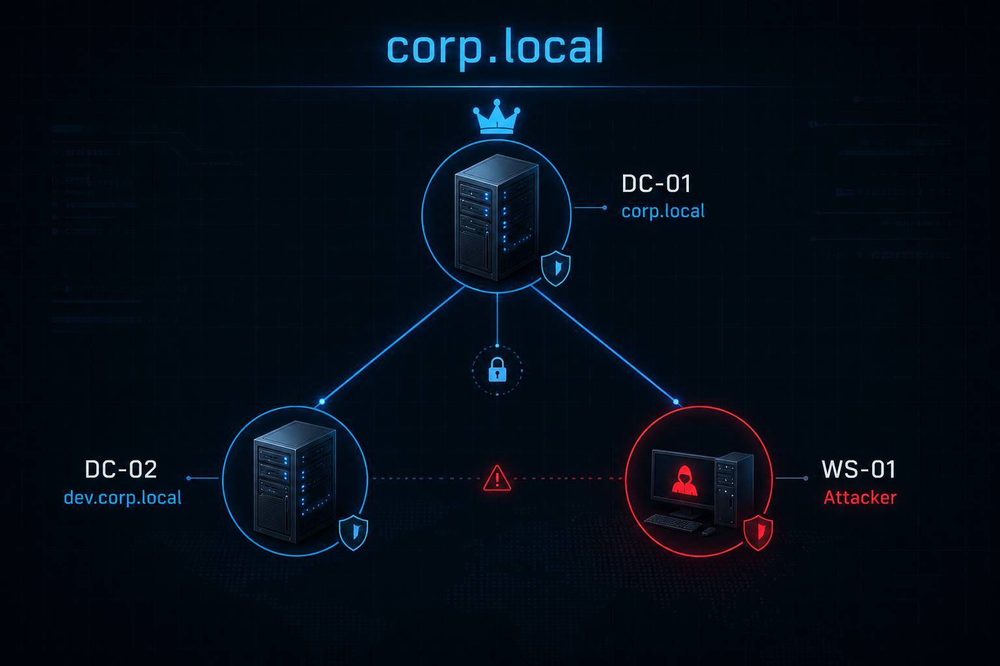

<div align="center">

# Active Directory Enumeration & Attacks Lab

**A fully automated, self-contained Active Directory lab for practicing real-world attack techniques**


</div>

---

> **Legal Disclaimer**
> This environment is for **educational and authorized lab usage only**.
> All misconfigurations are **intentional** and exist solely for learning purposes.
> Never deploy this lab on production networks or expose it to the internet.
> The author is not responsible for any misuse of this material.

---

## Overview

This lab simulates a realistic enterprise Active Directory environment with intentional
misconfigurations covering a wide range of AD attack techniques — from basic enumeration
to advanced persistence and cross-domain escalation.

**One command. Full lab. Start hacking.**

```bash
git clone https://github.com/0x4161/active-directory-lab.git
cd active-directory-lab
vagrant plugin install vagrant-reload
vagrant up
```

---

## Lab Topology



```
DC-01  192.168.56.10  —  corp.local (Forest Root DC + CA)
DC-02  192.168.56.20  —  dev.corp.local (Child Domain DC)
WS-01  192.168.56.30  —  Attacker Workstation

Network : Host-Only (192.168.56.0/24)
Internet: NAT (separate adapter)
```

---

## VM Specifications

| VM    | Role                  | OS                      | RAM  | CPU | Disk  | IP             |
|-------|-----------------------|-------------------------|------|-----|-------|----------------|
| DC-01 | Forest Root DC + CA   | Windows Server 2019     | 4 GB | 2   | 60 GB | 192.168.56.10  |
| DC-02 | Child Domain DC       | Windows Server 2019     | 4 GB | 2   | 60 GB | 192.168.56.20  |
| WS-01 | Attacker Workstation  | Windows 10/11           | 4 GB | 2   | 60 GB | 192.168.56.30  |

**Total RAM required: 12 GB minimum (16 GB recommended)**

---

## Quick Start

### Option A — Vagrant (Recommended)

**One command builds the entire lab automatically.**

```bash
# Requirements: VirtualBox + Vagrant
git clone https://github.com/0x4161/active-directory-lab.git
cd active-directory-lab

vagrant plugin install vagrant-reload
vagrant up
```

Vagrant downloads Windows base boxes (~12 GB total), provisions all 3 VMs, promotes the DCs, and runs all setup scripts automatically. Takes ~45-60 min on first run.

> See [INSTALL.md](INSTALL.md) for full Vagrant guide.

---

### Option B — Build From Scratch (Manual)

```bash
git clone https://github.com/0x4161/active-directory-lab.git
cd active-directory-lab
```

1. Create Host-Only network `vboxnet0` (`192.168.56.1`) in VirtualBox — DHCP disabled
2. Create 3 VMs: each with **Adapter 1: Host-Only** + **Adapter 2: NAT**
3. Install Windows Server 2019 on DC-01 and DC-02, Windows 10/11 on WS-01
4. **DC-01** → static IP `192.168.56.10` → run `setup/promote-dc01.ps1` → run `scripts/Setup-CorpLocal.ps1`
5. **DC-02** → static IP `192.168.56.20`, DNS `192.168.56.10` → run `setup/promote-dc02.ps1` → run `scripts/Setup-DevCorpLocal.ps1`
6. **WS-01** → static IP `192.168.56.30`, DNS `192.168.56.10` → run `setup/join-ws01.ps1`

> Full guide: [docs/LAB-SETUP.md](docs/LAB-SETUP.md) — Network config: [docs/NETWORK-SETUP.md](docs/NETWORK-SETUP.md)

---

## Default Credentials

| Account           | Domain          | Password   | Role                                  |
|-------------------|-----------------|------------|---------------------------------------|
| Administrator     | corp.local      | p@ssw0rd   | Domain Admin                          |
| admin1            | corp.local      | p@ssw0rd   | Domain Admin                          |
| **attacker.01**   | corp.local      | p@ssw0rd   | **Your starting point (low priv)**    |
| ahmad.ali         | corp.local      | p@ssw0rd   | IT Admin                              |
| fahad.salem       | corp.local      | p@ssw0rd   | Helpdesk Lead                         |
| sara.khalid       | corp.local      | p@ssw0rd   | HR Manager                            |
| faisal.omar       | corp.local      | p@ssw0rd   | Finance Director                      |
| walid.saeed       | corp.local      | p@ssw0rd   | Finance Analyst [AS-REP Roastable]    |
| svc_sql           | corp.local      | p@ssw0rd   | Service Account [Kerberoastable]      |
| svc_backup        | corp.local      | p@ssw0rd   | Service Account [DCSync Rights]       |
| faris.admin       | dev.corp.local  | p@ssw0rd   | Child Domain Admin                    |
| **attacker.dev**  | dev.corp.local  | p@ssw0rd   | Child domain starting point           |

> Full credentials list: [docs/ATTACK-PATHS.md](docs/ATTACK-PATHS.md)

---

## Extra Attack Surfaces (Optional)

After the base lab is running, you can add **14 additional attack surfaces** with one script:

```powershell
# On DC-01 — run after Setup-CorpLocal.ps1 completes
cd C:\vagrant\scripts   # or wherever you copied the repo
.\Setup-ExtraAttacks.ps1
```

> Safe to run on top of the existing lab — idempotent, nothing is removed or broken.

**What it enables:**

| # | Misconfiguration | Attack Technique |
|---|-----------------|-----------------|
| 1 | WDigest enabled | `sekurlsa::wdigest` → cleartext passwords in LSASS |
| 2 | NTLMv1 allowed | Downgrade NTLM → easier to crack / relay |
| 3 | RunAsPPL = 0 | Skeleton Key (`misc::skeleton`) — any password works |
| 4 | UAC token filter disabled | Pass-the-Hash via SMB/WinRM to local admins |
| 5 | Print Spooler running | PrinterBug (MS-RPRN) coercion → relay/capture DC hash |
| 6 | WebClient service running | WebDAV coercion → NTLM relay over HTTP |
| 7 | khalid.nasser → DnsAdmins | DLL injection via DNS service (runs as SYSTEM) |
| 8 | dana.rashid → Backup Operators | Copy NTDS.dit → dump all domain hashes offline |
| 9 | nasser.web → Account Operators | Create/modify users in most OUs |
| 10 | noura.ahmed → DCSync rights | Second independent DCSync path |
| 11 | maryam.hassan → WriteSPN on reem.sultan | Targeted Kerberoasting via WriteSPN ACE |
| 12 | hessa.jaber → AS-REP roastable | Extra AS-REP roasting target |
| 13 | Remote Registry enabled | Read SAM/SYSTEM hive remotely |
| 14 | Windows Firewall disabled | Unrestricted lateral movement |

**Attack guides for each technique:** [`attacks/09`](attacks/09-silver-ticket.md) · [`10`](attacks/10-pass-the-hash.md) · [`11`](attacks/11-skeleton-key.md) · [`12`](attacks/12-coercion.md) · [`13`](attacks/13-dns-admins.md) · [`14`](attacks/14-backup-operators.md)

---

## Attack Scenarios Included

| #  | Attack                              | Difficulty | Path                              |
|----|-------------------------------------|------------|-----------------------------------|
| 1  | Domain Enumeration                  | Easy       | BloodHound / PowerView            |
| 2  | Kerberoasting                       | Easy       | 6 service accounts                |
| 3  | AS-REP Roasting                     | Easy       | 4 users (incl. hessa.jaber)       |
| 4  | Password Spray                      | Easy       | Weak passwords                    |
| 5  | Credentials in AD Attributes        | Easy       | LDAP enumeration                  |
| 6  | GPP / SYSVOL Password               | Easy       | Groups.xml                        |
| 7  | WDigest — Cleartext Creds           | Easy       | Mimikatz sekurlsa::wdigest        |
| 8  | Pass-the-Hash                       | Easy       | LocalAccountTokenFilterPolicy=1   |
| 9  | ACL — GenericAll                    | Medium     | noura.ahmed -> faisal.omar        |
| 10 | ACL — WriteDACL                     | Medium     | ahmad.ali -> Finance Users        |
| 11 | ACL — ForceChangePassword           | Medium     | fahad.salem -> faisal.omar        |
| 12 | ACL — DCSync Rights                 | Medium     | svc_backup -> domain              |
| 13 | ACL — WriteOwner                    | Medium     | Helpdesk -> IT Admins             |
| 14 | ACL — WriteSPN (Targeted Kerberoast)| Medium     | maryam.hassan -> reem.sultan      |
| 15 | Shadow Credentials                  | Medium     | omar.coder -> WEB-SRV-01          |
| 16 | Unconstrained Delegation            | Medium     | WEB-SRV-01 / svc_web              |
| 17 | PrinterBug / PetitPotam Coercion    | Medium     | Coerce DC-01 auth -> relay/capture|
| 18 | DnsAdmins DLL Injection             | Medium     | khalid.nasser -> SYSTEM on DC-01  |
| 19 | Backup Operators — NTDS Dump        | Medium     | dana.rashid -> all domain hashes  |
| 20 | Account Operators — Account Abuse   | Medium     | nasser.web -> create/modify users |
| 21 | Silver Ticket                       | Hard       | svc_sql hash -> forge TGS         |
| 22 | Skeleton Key                        | Hard       | RunAsPPL=0 -> misc::skeleton      |
| 23 | Constrained Delegation (KCD)        | Hard       | svc_iis -> CIFS/DC-01             |
| 24 | Resource-Based Constrained (RBCD)   | Hard       | tariq.dev -> WEB-SRV-02           |
| 25 | DCSync (2nd path)                   | Hard       | noura.ahmed -> Replication rights |
| 26 | AdminSDHolder Persistence           | Hard       | svc_backup -> all DAs             |
| 27 | DSRM Abuse                          | Hard       | Local admin on DC                 |
| 28 | ADCS ESC1                           | Hard       | Forge admin certificate           |
| 29 | ADCS ESC4                           | Hard       | Modify writable template          |
| 30 | ADCS ESC6                           | Hard       | SAN in any template               |
| 31 | ADCS ESC7                           | Hard       | CA Manager abuse                  |
| 32 | ADCS ESC8                           | Hard       | NTLM relay to ADCS                |
| 33 | Golden Ticket                       | Expert     | After krbtgt dump                 |
| 34 | Child-to-Parent (ExtraSids)         | Expert     | dev -> corp.local EA              |
| 35 | Trust Ticket                        | Expert     | Inter-realm TGT forgery           |
| 36 | SID History Abuse                   | Expert     | dev.backdoor -> EA rights         |

---

## Network Configuration

```
VirtualBox Network Setup:

Adapter 1 (Host-Only): vboxnet0 — 192.168.56.0/24
  Purpose : VM-to-VM communication + host access
  DC-01   : 192.168.56.10 (static)
  DC-02   : 192.168.56.20 (static)
  WS-01   : 192.168.56.30 (static or DHCP)

Adapter 2 (NAT):
  Purpose : Internet access for downloading tools
  All VMs : DHCP (10.0.x.x)
```

---

## Supported Hypervisors

| Hypervisor            | Vagrant Support | Manual Build | Notes                          |
|-----------------------|-----------------|--------------|--------------------------------|
| VirtualBox 7.x        | ✅ Tested       | ✅ Tested    | Recommended                    |
| VMware Workstation 17 | ⚠️ Partial      | ✅ Compatible| vagrant-vmware-desktop plugin  |
| VMware ESXi           | ❌              | ✅ Compatible| Manual setup only              |
| Hyper-V               | ❌              | ⚠️ Partial  | Manual setup, limited support  |

---

## Screenshots

> Add screenshots to `/screenshots/` folder after setup.

```
screenshots/
├── 01-lab-topology.png
├── 02-bloodhound-graph.png
├── 03-kerberoast.png
├── 04-adcs-esc1.png
└── 05-golden-ticket.png
```

---

## Repository Structure

```
ad-lab/
├── README.md                  # This file
├── LICENSE                    # MIT License
├── .gitignore
├── INSTALL.md                 # Quick installation guide
├── docs/
│   ├── LAB-SETUP.md           # Detailed setup from scratch
│   ├── ATTACK-PATHS.md        # All attack paths with commands
│   ├── TROUBLESHOOTING.md     # Common issues and fixes
│   ├── REQUIREMENTS.md        # Hardware and software requirements
│   ├── VM-EXPORT.md           # How to export/import VMs
│   └── NETWORK-SETUP.md       # Network configuration guide
├── scripts/
│   ├── Setup-CorpLocal.ps1       # corp.local full setup
│   ├── Setup-DevCorpLocal.ps1    # dev.corp.local setup
│   ├── Setup-ExtraAttacks.ps1    # Extra attack surfaces (optional)
│   ├── Reset-AllPasswords.ps1    # Reset all lab passwords
│   ├── lab-start.sh              # Start all VMs
│   ├── lab-stop.sh               # Stop all VMs
│   ├── lab-reset.sh              # Reset snapshots
│   ├── lab-status.sh             # Check VM status
│   └── verify-lab.ps1            # Verify AD services
├── setup/
│   ├── promote-dc01.ps1       # Promote DC-01 to forest root
│   ├── promote-dc02.ps1       # Promote DC-02 to child domain
│   └── join-ws01.ps1          # Join WS-01 to domain
├── attacks/
│   ├── 01-enumeration.md
│   ├── 02-kerberoasting.md
│   ├── 03-asrep-roasting.md
│   ├── 04-delegation.md
│   ├── 05-acl-attacks.md
│   ├── 06-adcs.md
│   ├── 07-persistence.md
│   ├── 08-cross-domain.md
│   ├── 09-silver-ticket.md
│   ├── 10-pass-the-hash.md
│   ├── 11-skeleton-key.md
│   ├── 12-coercion.md
│   ├── 13-dns-admins.md
│   └── 14-backup-operators.md
├── enumeration/
│   ├── bloodhound-queries.md
│   ├── powerview-cheatsheet.md
│   └── ldap-enum.md
├── vm-export/
│   └── README.md
├── screenshots/
│   └── .gitkeep
├── wordlists/
│   ├── lab-users.txt
│   ├── lab-passwords.txt
│   └── README.md
└── tools/
    └── README.md
```

---

## Contributing

Contributions welcome. See [CONTRIBUTING.md](CONTRIBUTING.md).

---

## License

MIT License — see [LICENSE](LICENSE)

---

<div align="center">
Built for security education. Use responsibly.
</div>
